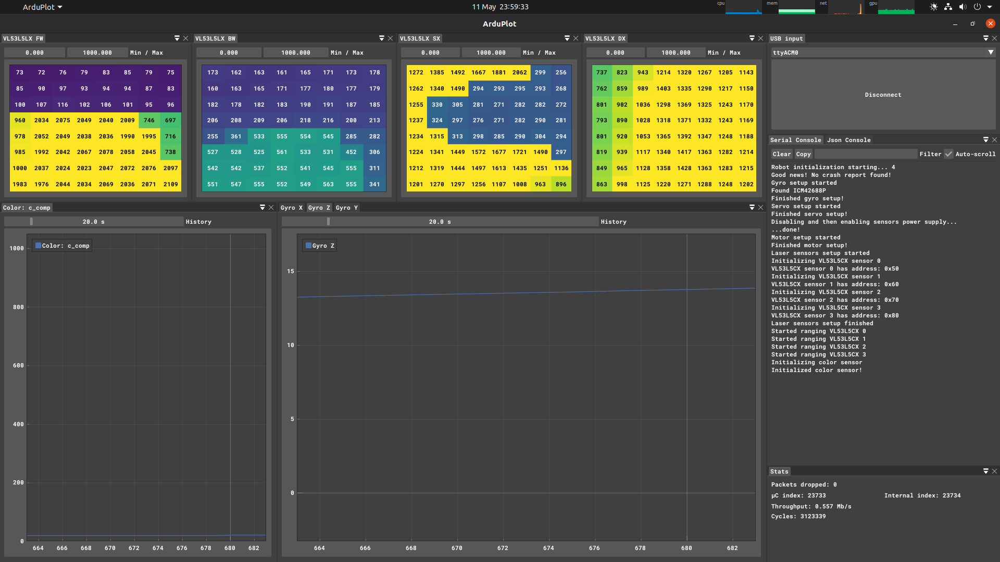

# ArduPlot

A real-time serial plotter that automatically adjusts itself to your use case.

<p>
  
</p>

ArduPlot acts both as a traditional serial monitor and a real-time data visualization tool.

When a specially formatted packet is received by ArduPlot, such as this one:

``` json
{"1&n&l&Gyro X":-1.892217994,"1&n&l&Gyro Y":-3.09271574,"1&n&l&Gyro Z":-0.000549316,"2&n&l&Front distance (cm)":0,"2&n&l&Front strength":0,"0&n&h&VL53L5LX&8&8&0&1000":[662,653,644,643,639,637,635,595,648,648,633,634,633,632,621,604,652,637,633,634,628,619,593,405,631,637,641,607,622,598,311,283,326,320,327,315,299,290,284,272,276,278,276,282,283,294,314,296,274,272,275,266,277,299,322,302,218,223,207,185,203,231,245,261],"3&n&l&Color: b_comp":0,"3&n&l&Color: c_comp":0,"3&n&l&Color: g_comp":0,"3&n&l&Color: r_comp":0,"0&i":3}
```

It gets parsed and turned into different graphs, depending on the json key value.

This leaves to the microcontroller the choice of how to best display the data it has.

To correctly format the data, [MicroPlot](https://github.com/Dave879/MicroPlot) is used.

## Supported graph types

- Line
- Multi-line
- Heatmap

## Future features

- Bar graph
- Scatter plot
- Scroll back and stop ArduPlot time
- Save and inspect data
- Optional CRC in communication

## Running ArduPlot

To run ArduPlot, you need to download the precompiled binaries from the [Releases page](https://github.com/Dave879/ArduPlot/releases)

Then navigate in the folder where you extracted ArduPlot and run 

``` bash
./ArduPlot
```

If necessary, change the permissions of the `ArduPlot` file:

``` bash
chmod +x ArduPlot
```

### Additional info for Linux users

Make sure the current user is in the `dialout` group, otherwise you will get an error while trying to connect to the serial port. To check you can run the following command:

``` bash
groups $USER
```

To add your user to the group, run the following command, then reboot.

``` bash
sudo usermod -a -G dialout $USER
```

## Building ArduPlot

Clone the repository

``` bash
git clone --recurse-submodules https://github.com/Dave879/ArduPlot.git 
```

Install the packages `xorg-dev` and `libx11-dev`:

``` bash
sudo apt install xorg-dev libx11-dev
```

In the case of a Debian-based distro

Then, to configure the CMake project, run:

``` bash
./scripts/configure.sh
```

To build:

``` bash
./scripts/build.sh
```

Then, to run ArduPlot:

``` bash
./scripts/run.sh
```

There is an additional script which is a shorthand of running `./scripts/build.sh` and then `./scripts/run.sh` which is called `./scripts/buildandrun.sh`

> **_NOTE:_** The [-j flag](https://cmake.org/cmake/help/latest/manual/cmake.1.html#build-a-project) can be appended to the `./scripts/build.sh` and `./scripts/buildandrun.sh` commands to speed up compilation

<p>
  
</p>

<p>
  
</p>
